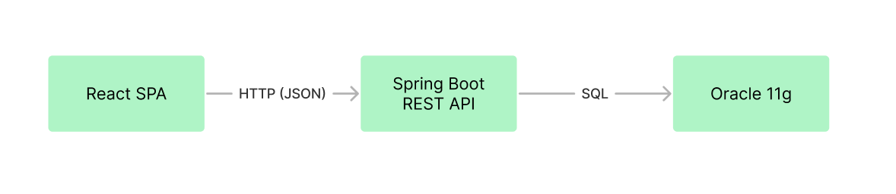
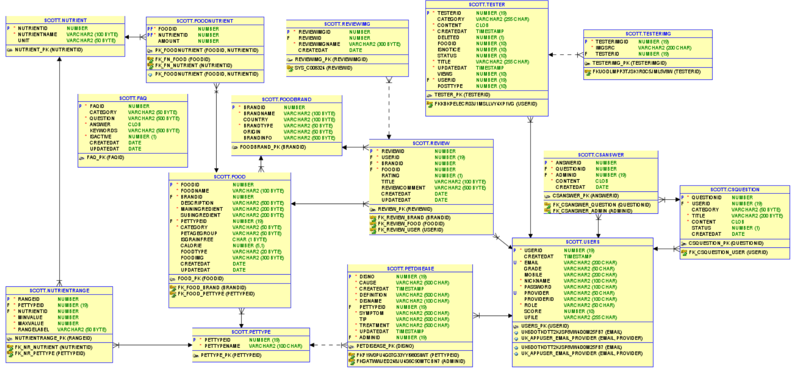
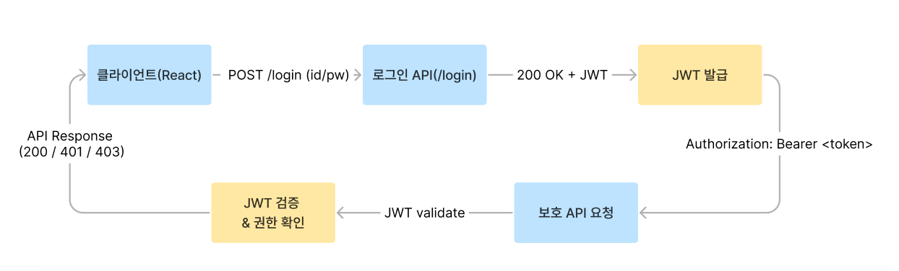

# 🚀 박현주 | Full-Stack Developer

<table>
<tr>
<td width="30%" align="center">

</td>

<td width="70%">
<strong>프로토타입 → 운영형 서비스 → 아키텍처 전환</strong>까지 
단계적으로 확장하며 완성도를 끌어올리는 풀스택 개발자입니다. 
기능 구현뿐 아니라 <strong>데이터 흐름 / 보안 / 성능 / 배포 관점까지</strong> 함께 설계합니다.
  

<strong>🔗 Links</strong> 

</td>
</tr>
</table>
---

**🔗 Links**
- **Email**: tkasid00@gmail.com  
- **GitHub**: https://github.com/tkasid00/fullstack_hj  
- **Notion Portfolio**: https://www.notion.so/Portfolio-2f91af5ceed28014af16f65453ed5b0b?source=copy_link  

---

## 💡 Contact
- **Email**: tkasid00@gmail.com  
- **GitHub**: https://github.com/tkasid00/fullstack_hj  
- **Notion Portfolio** : https://www.notion.so/Portfolio-2f91af5ceed28014af16f65453ed5b0b?source=copy_link

---

## 🛠 Tech Stack

### Backend

### Database / Cache

### Frontend

### DevOps / Collaboration

### External API
-Integration-412991?style=for-the-badge&logo=openai&logoColor=white)

---

## 🏆 Featured Project
## 🐾 Pawject (v1~v4) | 반려동물 건강 & 사료 종합 플랫폼

> 게시판 기반 MVP에서 출발해  
> 검색/페이징/AJAX/업로드 → 외부 API 연동(OCR/ChatGPT/채널톡/지도·날씨) →  
> React 분리 아키텍처 + JWT + Redis + CI/CD 적용까지  
> **버전업 형태로 점진적 확장/고도화한 팀 프로젝트**입니다.

| Version | 기간 / 인원 | 핵심 키워드 | README |
|---|---|---|---|
| **v1** | 2025.11.03 ~ 2025.11.07 (5명) | JSP/Servlet MVC2 · 게시판 MVP · CRUD | [v1 README](https://github.com/taehun00/thejoeun/tree/master/pawject4) |
| **v2** | 2025.12.01 ~ 2025.12.07 (4명) | Spring Boot · 검색/페이징 · AJAX · 다중 이미지 | [v2 README](https://github.com/taehun00/thejoeun/tree/master/pawject3) |
| **v3** | 2025.12.22 ~ 2026.01.02 (4명) | OCR/ChatGPT/채널톡 · 고객센터 · 사료검색 · 운영형 확장 | [v3 README](https://github.com/taehun00/thejoeun/tree/master/pawject2) |
| **v4** | 2026.01.19 ~ 2026.01.31 (3명) | React 분리 아키텍처 · JWT · Redis · CI/CD | [v4 README](https://github.com/taehun00/thejoeun/tree/master/pawject1) |

---

## 🎬 Demo Videos
> 시연 영상을 클릭하면 해당 유튜브 페이지로 연결됩니다 

| v4  | v3 | v2 |
|---|---|---|
|  |  |  |

<!-- 
- **Pawject v2**: [Demo 바로가기](https://youtu.be/1OgiHFzOJ4M?si=H2PXJA83mKoEiYQf)  
- **Pawject v3**: [Demo 바로가기](https://youtu.be/ZDb0pKXf4I8?si=b6lUqrv4nmD-QVcs)  
- **Pawject v4**: [README 바로가기](./pawject4/README.md)  -->
---

## 🏗 Architecture

> v4는 React SPA + Spring Boot REST API 구조로 프론트/백엔드를 분리하고
> JWT 인증 기반으로 사용자/관리자 권한별 기능을 제어한 운영형 구조입니다.

---

### 1) System Architecture

 

- **Frontend (Client)**: React SPA
- **Backend (API Server)**: Spring Boot REST API
- **Auth**: JWT 기반 인증/인가
- **Database**: Oracle

---

### 2) ERD

 

- 사용자(USERS) 중심으로 리뷰/사료/건강정보/체험단/고객센터 도메인을 연결했습니다.
- 영양 정보는 교차 테이블 기반으로 정규화하여( N:M ) 확장 가능한 구조로 설계했습니다.

---

### 3) Auth Flow (JWT)
 

- 로그인 성공 시 JWT 발급
- 이후 요청은 `Authorization: Bearer <token>` 형태로 JWT 전달
- 서버에서 토큰 검증 후 Role 기반 접근 제어 적용

---

### 4) CI/CD Pipeline

- GitHub 기반 협업 및 버전 관리
- CI/CD Pipeline: 예정 (배포 이후 업데이트)

📌 CI/CD Diagram (Planned)
- GitHub → Actions(Build/Test) → Deploy → Running

---

## 📘 Troubleshooting Notes
> 학습/프로젝트 과정에서 발생한 문제 해결 과정을 문서화했습니다.

- **Git**
  - [Git/GitHub](docs/troubleshooting/github.md)
- **Frontend**
  - [Web Basic](docs/troubleshooting/web-basic.md)
- **Backend**
  - [Java](docs/troubleshooting/java.md)
  - [Spring](docs/troubleshooting/spring.md)
  - [Oracle](docs/troubleshooting/oracle.md)
---

## 🎮 Other Project
## from Stray to Home (Java Console Project)
> 유기묘 임시 보호 시뮬레이션 콘솔 프로젝트  
> **인터페이스 기반 객체지향 구조로 리팩토링**하여 확장성과 유지보수성을 개선했습니다.

---